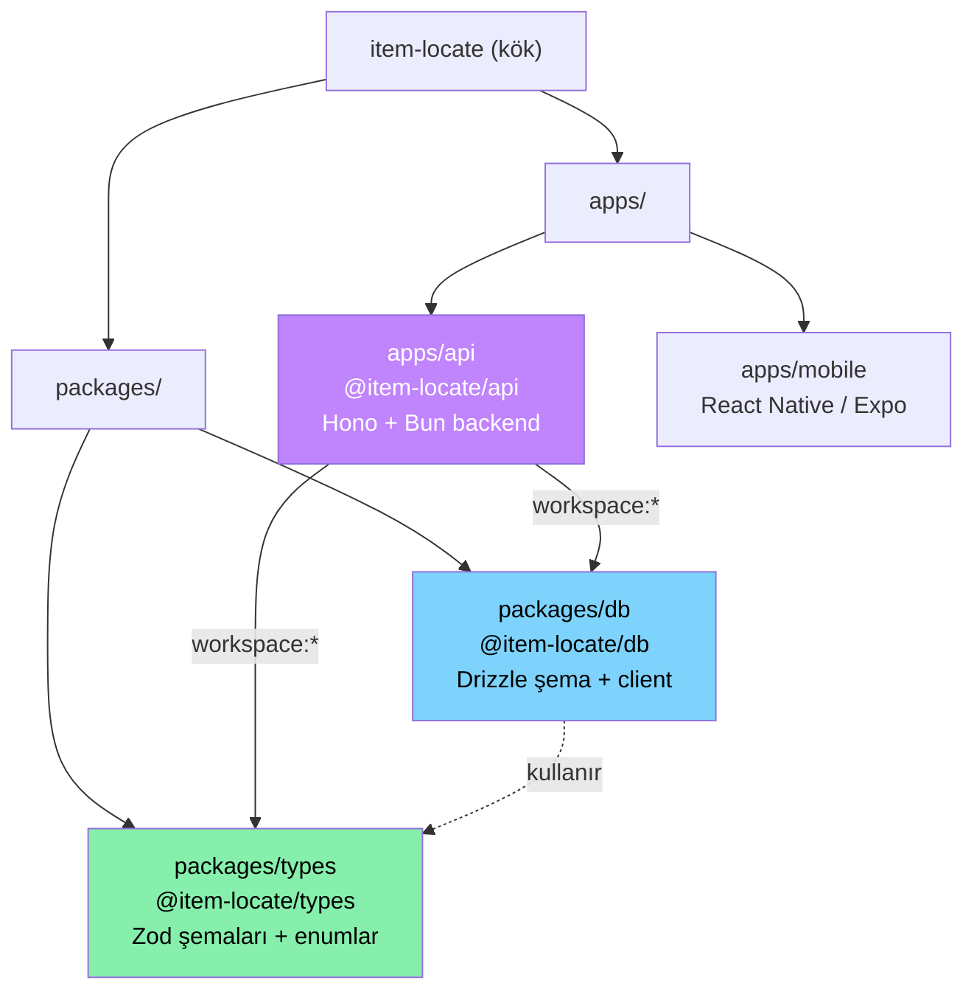
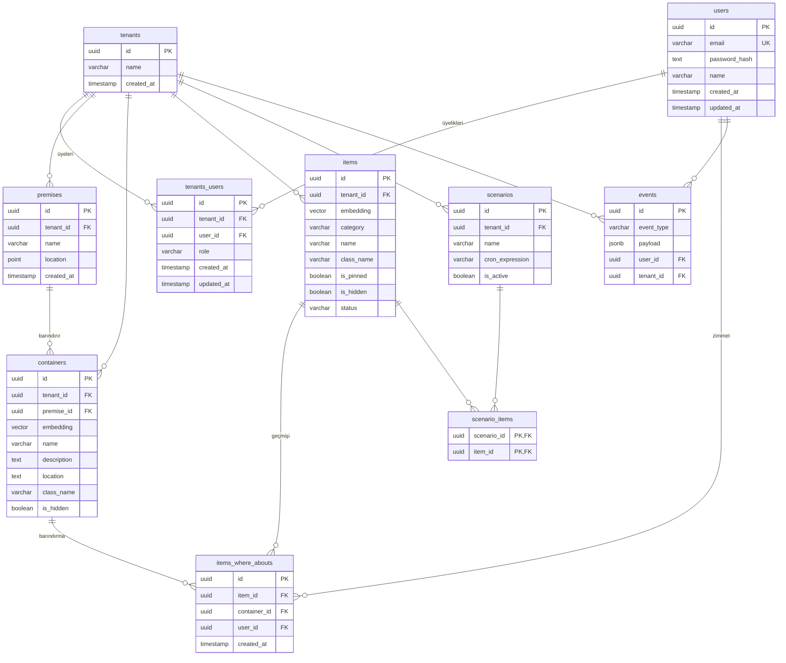
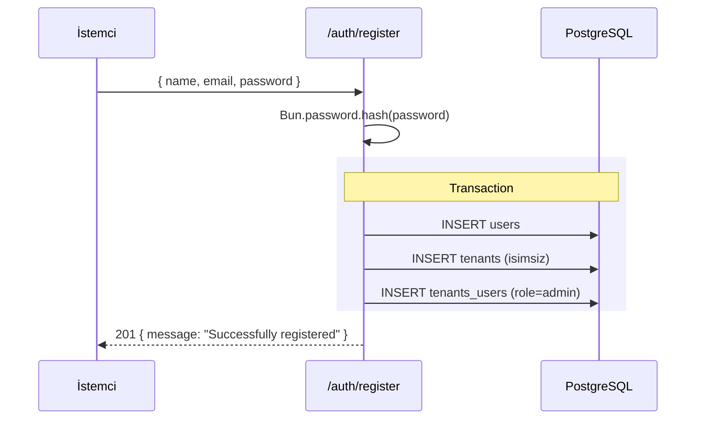
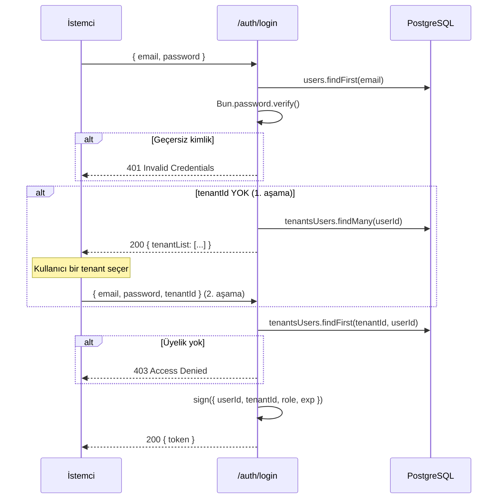
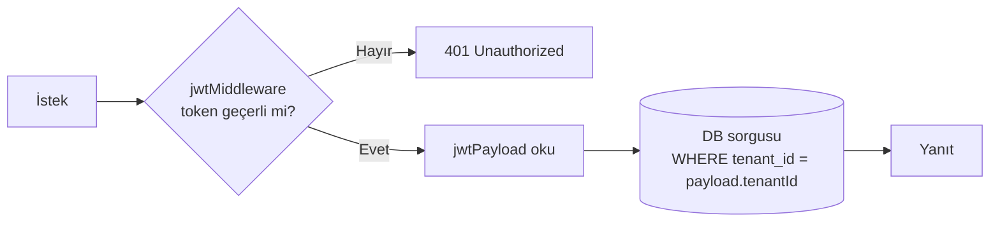
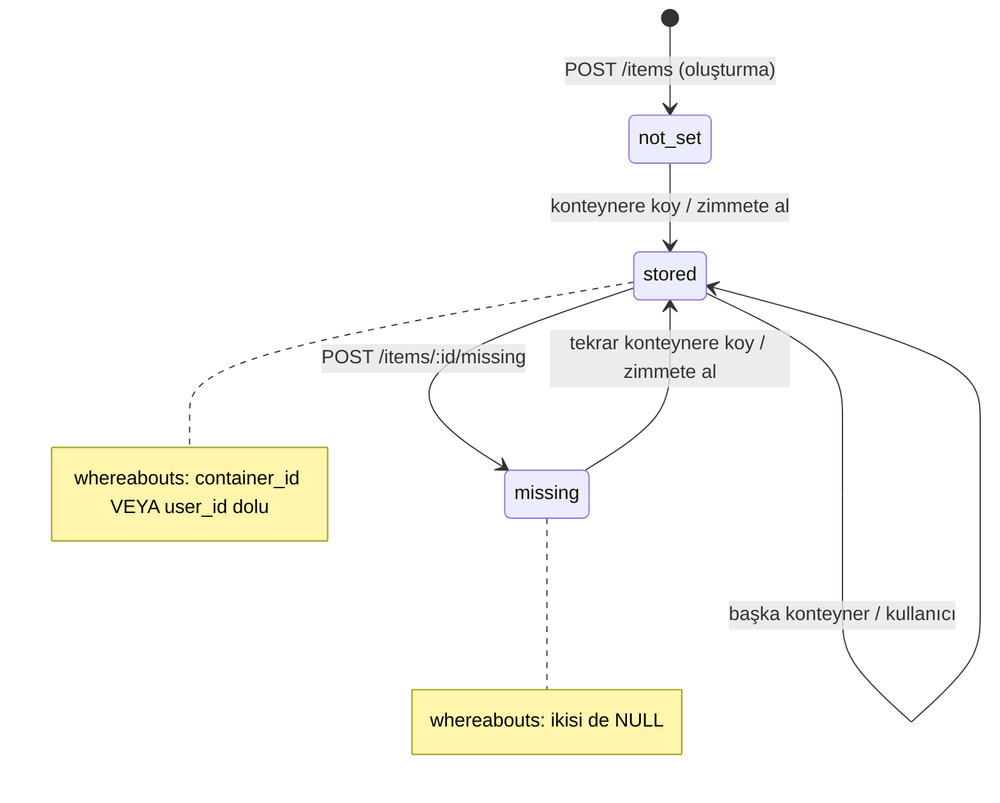
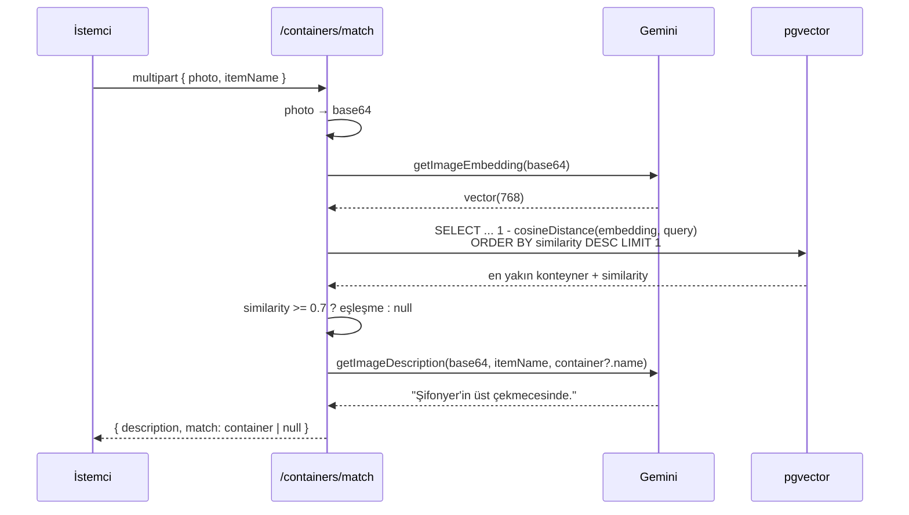

# item-locate — Teknik Doküman

> **WiMZ — "Where is my stuff?"**
> Çok kiracılı (multi-tenant), AI destekli eşya konum takip sistemi. Kullanıcılar eşyalarını fotoğraflar, AI bunları gömülü vektörlere (embedding) dönüştürür ve daha sonra çekilen bir fotoğrafla eşyanın hangi konteynerde bulunduğunu görsel benzerlik üzerinden tahmin eder.

---

## 1. Genel Bakış

item-locate; ev/ofis gibi mekânlardaki (premise) dolap, çekmece, raf gibi konteynerlere yerleştirilen eşyaların konumunu takip eden bir backend sistemidir. Sistemin ayırt edici özelliği, eşya ve konteyner fotoğraflarından **multimodal embedding** üreterek görsel eşleştirme (visual matching) yapmasıdır.

| Katman | Teknoloji |
|--------|-----------|
| Runtime | [Bun](https://bun.sh) |
| HTTP Framework | [Hono](https://hono.dev) |
| ORM | [Drizzle ORM](https://orm.drizzle.team) |
| Veritabanı | PostgreSQL + `pgvector` |
| Auth | JWT (HS256) — `hono/jwt` |
| Doğrulama | Zod |
| AI | Google Gemini (`@google/genai`) — embedding + vision |
| Mobil | React Native (Expo) |
| Paket Yönetimi | Bun workspaces (monorepo) |

---

## 2. Monorepo Yapısı

Proje, Bun workspaces ile yönetilen bir monorepodur. Kök `package.json` içinde `apps/*` ve `packages/*` workspace olarak tanımlıdır.



### Workspace'ler

| Paket | Yol | Sorumluluk |
|-------|-----|-----------|
| `@item-locate/api` | `apps/api` | HTTP API — route'lar, middleware, AI entegrasyonu |
| `@item-locate/db` | `packages/db` | Drizzle şema, ilişkiler, db client (singleton) |
| `@item-locate/types` | `packages/types` | Paylaşılan Zod şemaları ve enum'lar (API + mobil) |
| mobil uygulama | `apps/mobile` | React Native / Expo istemci (henüz iskelet halinde) |

### Önemli dosyalar

- `apps/api/src/index.ts` — Hono uygulaması, global hata yöneticisi, route montajı
- `apps/api/src/middleware.ts` — JWT doğrulama middleware'i
- `apps/api/src/embeddings.ts` — Gemini embedding + görsel açıklama fonksiyonları
- `apps/api/utils/config.ts` — Zod ile doğrulanan ortam değişkenleri
- `packages/db/src/schema.ts` — Tüm tablo tanımları
- `packages/db/src/relations.ts` — Drizzle ilişki tanımları
- `drizzle.config.ts` — Migration konfigürasyonu

### Uygulama bootstrap

`apps/api/src/index.ts` tüm route gruplarını kök yola (`/`) monte eder; her route dosyası kendi tam path'lerini (`/auth/...`, `/items/...`) tanımlar:

```ts
app.route("/", tenantsApp);
app.route("/", authsApp);
app.route("/", containersApp);
app.route("/", itemsApp);
app.route("/", usersApp);
app.route("/", premisesApp);
```

Global hata yöneticisi `HTTPException`'ları olduğu gibi döner, diğer hataları loglayıp `500 Internal Server Error` olarak yanıtlar.

---

## 3. Veritabanı Şeması

PostgreSQL + `pgvector` uzantısı kullanılır. Tüm birincil anahtarlar **UUIDv7** (`uuid` paketi) ile üretilir — zaman-sıralı olduğundan indeks lokalitesi sağlar. Embedding alanları `vector(768)` tipindedir.

### 3.1 İlişki Diyagramı (ER)



### 3.2 Tablolar

#### Çekirdek tablolar

**`users`** — Global kullanıcı hesapları (tenant'tan bağımsız). Email benzersizdir; parolalar `Bun.password.hash` (argon2) ile saklanır.

**`tenants`** — Kiracılar (örn. bir hane veya kurum). `name` nullable'dır (kayıt sırasında isimsiz oluşturulabilir).

**`tenants_users`** — Kullanıcı-tenant üyelik (join) tablosu. `role` alanı `"admin"` veya `"member"` değerini alır (varsayılan `member`). `(tenant_id, user_id)` çifti üzerinde **unique** kısıt vardır. Bir kullanıcı birden çok tenant'a üye olabilir — bu sistemin çok kiracılı çekirdeğidir.

**`premises`** — Fiziksel mekânlar (bina/ev/ofis). PostgreSQL `point` tipinde coğrafi `location` taşır.

**`containers`** — Eşyaların konabileceği fiziksel kaplar (dolap, çekmece, raf). `embedding vector(768)` alanı görsel eşleştirme için kullanılır. İsteğe bağlı olarak bir `premise`'e bağlanır (`onDelete: set null`).

**`items`** — Takip edilen eşyalar. `embedding vector(768)`, `status` (`missing` / `not_set` / `stored`), `is_pinned`, `is_hidden`, `category` alanlarını taşır.

**`items_where_abouts`** — Eşya konum geçmişi (append-only / olay günlüğü). Her satır bir eşyanın belirli bir andaki konumunu temsil eder. **Konum yorumlama mantığı**:
  - `container_id` dolu, `user_id` boş → eşya bir konteynerde
  - `container_id` boş, `user_id` dolu → eşya bir kullanıcının üzerinde (zimmette)
  - ikisi de boş → eşya kayıp (missing)

  En güncel konum, `created_at` en büyük olan satırdır. Geçmiş asla güncellenmez, yalnızca yeni satır eklenir.

#### Otomasyon tabloları (şema mevcut, route henüz yok)

**`scenarios`** — `cron_expression` ile zamanlanmış otomasyon senaryoları.
**`scenario_items`** — Senaryo-eşya çoka-çok join tablosu (bileşik PK).

#### Sistem tabloları

**`events`** — `jsonb` payload taşıyan olay/audit günlüğü (örn. `ITEM_MARKED_MISSING`, `USER_REGISTERED`).

> **Not:** `scenarios`, `scenario_items` ve `events` tabloları şemada tanımlıdır ancak henüz bunları kullanan bir API route'u bulunmamaktadır — gelecek özellikler için altyapı niteliğindedir.

### 3.3 Migration

Drizzle Kit ile yönetilir (`drizzle.config.ts`):

```bash
bun run db:generate   # şemadan SQL migration üret
bun run db:migrate    # migration'ları uygula
```

Çıktı dizini: `packages/db/drizzle`.

---

## 4. Authentication Akışı

Kimlik doğrulama **JWT (HS256)** tabanlıdır. Kritik tasarım kararı: sistem çok kiracılı olduğundan, token **hem kullanıcıyı hem de aktif tenant'ı** taşır. Bir kullanıcı birden çok tenant'a üyeyse, login iki aşamalıdır.

### 4.1 JWT Payload

```ts
// apps/api/src/types.ts
type AppVariables = {
  jwtPayload: {
    userId: string
    tenantId: string   // AKTİF tenant — yetkilendirme bunun üzerinden yapılır
    role: string        // o tenant'taki rol: "admin" | "member"
    exp: number         // unix timestamp (varsayılan +24 saat)
  }
}
```

JWT secret en az 32 karakter olmalıdır (`config.ts` içinde Zod ile zorunlu kılınır). Süre `JWT_EXPIRES_IN_HOURS` ile ayarlanır (varsayılan 24).

### 4.2 Kayıt (Register)

`POST /auth/register` — Tek bir transaction içinde üç tablo doldurulur: kullanıcı oluşturulur, isimsiz bir tenant oluşturulur, ve kullanıcı bu tenant'a **admin** olarak bağlanır.



### 4.3 İki Aşamalı Login

Login isteği `tenantId` içermezse, kullanıcının üye olduğu tenant listesi döner (token **verilmez**). İstemci bir tenant seçip `tenantId` ile tekrar login olur ve token alır.



> **Güvenlik notu (kodda işaretli):** `isValid = user && await Bun.password.verify(...)` ifadesi short-circuit olduğundan, kullanıcı yoksa parola doğrulaması hiç çalışmaz. Bu durum **timing attack** açısından kullanıcı enumerasyonuna kapı aralayabilir (var olmayan email daha hızlı yanıt döner). Kod yorumunda bu risk belirtilmiştir.

### 4.4 Token Yenileme & Tenant Değiştirme

`POST /auth/token/refresh` — Geçerli bir token ile farklı bir `tenantId` gönderilerek **aktif tenant değiştirilebilir**. Kullanıcının hedef tenant'a üyeliği doğrulanır, ardından yeni tenant için yeni token üretilir. Bu, tek login ile tenant'lar arası geçiş sağlar.

### 4.5 Korumalı Route'lar

`jwtMiddleware` (`hono/jwt` wrapper'ı) korumalı her route'a eklenir. Token doğrulandıktan sonra payload `c.get("jwtPayload")` ile okunur. **Tüm veri erişimi `payload.tenantId` ile filtrelenir** — tenant izolasyonunun uygulandığı yer burasıdır.



---

## 5. API Endpoint Referansı

Tüm korumalı endpoint'ler `Authorization: Bearer <token>` başlığı gerektirir. Yetkilendirme genel ilkesi: kaynak, token'daki `tenantId` ile eşleşmiyorsa `403 Access denied` döner.

### 5.1 Auth — `apps/api/src/routes/auth.ts`

| Method | Path | Auth | Açıklama |
|--------|------|------|----------|
| POST | `/auth/register` | — | Kullanıcı + isimsiz tenant + admin üyelik oluşturur |
| POST | `/auth/login` | — | 1. aşama: tenant listesi · 2. aşama (`tenantId` ile): token |
| POST | `/auth/token/refresh` | JWT | Aktif tenant'ı değiştirir, yeni token verir |
| GET | `/auth/me` | JWT | Aktif kullanıcı + tenant adı + rol |

### 5.2 Tenants — `apps/api/src/routes/tenants.ts`

| Method | Path | Auth | Açıklama |
|--------|------|------|----------|
| GET | `/tenants` | JWT | Kullanıcının üye olduğu tüm tenant'lar |
| GET | `/tenants/users` | JWT | Aktif tenant'ın tüm üyeleri (rolleriyle) |
| GET | `/tenants/users/:userId` | JWT (admin) | Belirli bir üyenin detayları — **admin gerektirir** |
| POST | `/tenants` | JWT | Yeni tenant oluşturur, çağıranı admin yapar |
| POST | `/tenants/users` | JWT (admin) | Aktif tenant'a toplu üye ekler — **admin gerektirir** |

### 5.3 Premises — `apps/api/src/routes/premises.ts`

Tam CRUD. Tüm işlemler tenant-kapsamlıdır.

| Method | Path | Auth | Açıklama |
|--------|------|------|----------|
| GET | `/premises` | JWT | Tenant'ın tüm mekânları |
| POST | `/premises` | JWT | Mekân oluşturur (`name`, `location {x,y}`) |
| GET | `/premises/:id` | JWT | Tek mekân |
| PATCH | `/premises/:id` | JWT | Mekân günceller (kısmi) |
| DELETE | `/premises/:id` | JWT | Mekân siler |

### 5.4 Containers — `apps/api/src/routes/containers.ts`

| Method | Path | Auth | Açıklama |
|--------|------|------|----------|
| GET | `/containers` | JWT | Tenant'ın konteynerleri (id, name, isHidden) |
| GET | `/containers/:id` | JWT | Tek konteyner |
| GET | `/containers/:id/items` | JWT | Konteynerdeki **güncel** eşyalar (en son whereabouts'a göre) |
| POST | `/containers` | JWT | Konteyner oluşturur — opsiyonel fotoğraf → embedding (multipart) |
| POST | `/containers/:id/items/:itemId` | JWT | Eşyayı konteynere yerleştirir, status=`stored` |
| POST | `/containers/match` | JWT | **AI görsel eşleştirme** — fotoğraftan konteyner tahmini + açıklama |

> `GET /containers/:id/items` ilginç bir SQL kullanır: her eşyanın yalnızca **en güncel** whereabouts kaydını almak için bağlı (correlated) alt sorgu ile `MAX(created_at)` filtrelemesi yapar.

### 5.5 Items — `apps/api/src/routes/items.ts`

| Method | Path | Auth | Açıklama |
|--------|------|------|----------|
| GET | `/items` | JWT | Tenant'ın tüm eşyaları |
| GET | `/items/:id` | JWT | Tek eşya |
| POST | `/items` | JWT | Eşya oluşturur — opsiyonel fotoğraf → embedding (multipart) |
| GET | `/items/:id/where` | JWT | Eşyanın **şu anki konumu** (container / user / missing) |
| POST | `/items/:id/missing` | JWT | Eşyayı kayıp işaretler, status=`missing` |

### 5.6 Users — `apps/api/src/routes/users.ts`

| Method | Path | Auth | Açıklama |
|--------|------|------|----------|
| POST | `/users/me/items/:id` | JWT | Eşyayı çağıran kullanıcının zimmetine alır, status=`stored` |

### 5.7 Eşya Durum (Status) Makinesi

Bir eşyanın `status` alanı, konum işlemleriyle değişir. Her geçiş aynı zamanda `items_where_abouts` tablosuna bir satır ekler.



---

## 6. AI Özellikleri

AI entegrasyonu Google Gemini (`@google/genai`) ile yapılır ve iki yetenekten oluşur: **görsel embedding** (vektör arama için) ve **vision/açıklama üretimi**. Mantık `apps/api/src/embeddings.ts` içindedir.

### 6.1 Görsel Embedding

`getImageEmbedding(base64)` — Bir fotoğrafı `gemini-embedding-2` modeline gönderir ve **768 boyutlu** bir vektör döner. Bu vektör `containers.embedding` / `items.embedding` alanlarında `pgvector` ile saklanır.

```ts
genAI.models.embedContent({
  model: "gemini-embedding-2",
  contents: [{ inlineData: { mimeType: "image/jpeg", data: imageBase64 } }],
  config: { outputDimensionality: 768 }
})
```

Embedding, `POST /containers` ve `POST /items` sırasında multipart `photo` alanı varsa **opsiyonel** olarak üretilir.

### 6.2 Görsel Açıklama (Vision)

`getImageDescription(base64, itemName, containerName?)` — `gemini-3.5-flash` vision modeline fotoğraf + bağlama duyarlı bir prompt gönderir. Eşleşen bir konteyner bulunmuşsa prompt daha spesifik olur ("Şifonyer'in üst çekmecesinde gibi"), yoksa sahnedeki mobilyalara odaklanan genel bir prompt kullanılır.

### 6.3 Görsel Eşleştirme Akışı — `POST /containers/match`

Sistemin merkezi AI özelliği. Kullanıcı bir eşyayı bir yere koyarken sahnenin fotoğrafını çeker; sistem hangi konteynere konduğunu görsel benzerlikle tahmin eder ve doğal dilde bir açıklama üretir.



**Eşleştirme detayları:**
- Benzerlik metriği: **kosinüs benzerliği** = `1 - cosineDistance(embedding, queryEmbedding)`
- Sorgu yalnızca aktif tenant'ın konteynerleri arasında yapılır (tenant izolasyonu)
- **Eşik (threshold): 0.7** — altında kalan en yakın eşleşme `null` kabul edilir
- Açıklama her durumda üretilir; eşleşme varsa konteyner adı prompt'a dahil edilerek daha isabetli sonuç alınır

### 6.4 AI Geçmişi (Git)

Embedding altyapısı evrim geçirmiştir (commit geçmişinden): Google Vertex AI → `@langchain/community` / `@xenova/transformers` denemeleri → mevcut `@google/genai` (Gemini GenAI). Kök `package.json` hâlâ `@langchain/community`, `@xenova/transformers` ve `google-auth-library` bağımlılıklarını taşır; aktif kod yolu yalnızca `@google/genai` kullanır.

---

## 7. Konfigürasyon

Ortam değişkenleri `apps/api/utils/config.ts` içinde Zod ile başlangıçta doğrulanır — eksik/hatalı değer varsa uygulama açılışta çöker (fail-fast).

| Değişken | Zorunlu | Varsayılan | Açıklama |
|----------|---------|-----------|----------|
| `JWT_SECRET` | ✅ (min 32 karakter) | — | JWT imzalama anahtarı |
| `JWT_EXPIRES_IN_HOURS` | — | 24 | Token geçerlilik süresi (saat) |
| `DATABASE_URL` | ✅ | — | PostgreSQL bağlantı dizesi |
| `GOOGLE_API_KEY` | ✅ | — | Gemini API anahtarı |

---

## 8. Çalıştırma

```bash
# Bağımlılıkları kur (kökte)
bun install

# Veritabanı migration
bun run db:generate
bun run db:migrate

# API'yi geliştirme modunda (hot reload) başlat
bun run dev          # → apps/api, bun run --hot src/index.ts
```

> **Önkoşul:** `pgvector` uzantısı yüklü bir PostgreSQL örneği gereklidir (`CREATE EXTENSION vector;`).

---

## 9. Mimari Notlar & Gözlemler

- **Çok kiracılık her şeyin merkezinde.** Kullanıcılar global, ama tüm veriler tenant-kapsamlı. Aktif tenant JWT'de taşınır; her sorgu `tenant_id` ile filtrelenir. Tenant değişimi yeni token gerektirir.
- **Konum geçmişi append-only.** `items_where_abouts` asla güncellenmez — her konum değişimi yeni satırdır. Güncel konum = en son `created_at`. Bu, tam bir eşya hareket geçmişi sağlar.
- **Embedding opsiyoneldir.** Fotoğraf olmadan da konteyner/eşya oluşturulabilir; sadece görsel eşleştirme devre dışı kalır.
- **Henüz bağlanmamış altyapı.** `scenarios`, `scenario_items`, `events` tabloları ve `pathAnalyzeSchema` Zod şeması mevcut ama route'ları yok — planlanmış otomasyon/audit özellikleri.
- **Mobil uygulama iskelet halinde.** `apps/mobile` yalnızca statik bir login ekranı içerir; API entegrasyonu henüz yapılmamıştır (`// API isteği buraya gelecek`).
- **Açık güvenlik notu.** Login'deki kullanıcı enumerasyonu/timing riski kod içinde işaretlenmiştir (bkz. §4.3).
